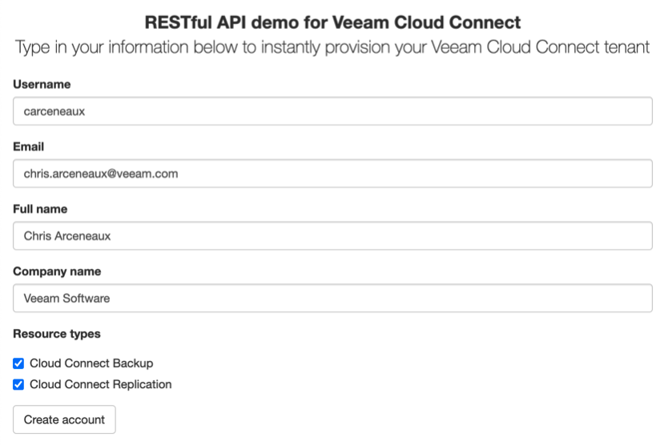

# Veeam Cloud Connect RESTful API demo

This is a demo portal for Veeam Cloud Connect provisioning. This project uses the Veeam Service Provider Console API to accomplish this.

## 📗 Documentation

### Requirements

* Web server w/PHP support
  * *Apache was used in my testing*
* [Composer](https://getcomposer.org/)
  * *Manages project dependencies*

### Installation

Below instructions assume the requirements listed above have already been installed & configured.

#### 1. Open a terminal & navigate to your web root directory

For me, this was: `/var/www/html/`

This can vary depending on your OS and web server used.

#### 2. Clone this repository

`git clone https://github.com/VeeamHub/veeam-cloud-connect.git .`

This command clones the repository to the current folder.

#### 3. Initialize Composer

`composer install`

This command initializes composer for the project and installs any project [dependencies](composer.json).

### Usage

Point your web browser to `index.php` of your web server and you should see something like this:



### Configuration

There are a few variables that need be changed before these sample scripts will work.

#### config/config.php

This script contains all variables defined in this project. **I highly recommend you deny public access to the `config` folder.**

At a bare minimum, you need to configure the below values in the `config.php` for this project to work in your environment:

```php
# Veeam Service Provider Console RESTful API connection
'vspc_rest_url' => 'https://vspc.contoso.local:1280/api/v3/',
'vspc_rest_user' => 'contoso\jdoe',
'vspc_rest_pass' => 'password',

# VCC values (as seen in VSPC)
'vcc_server' => 'vcc.contoso.local',
'vcc_repository' => 'Default Backup Repository',

# VCC-R values
'hardware_plan' => 'Hardware plan 1',
```

#### veeam.class.php

This script contains the functionality for interacting with the Veeam Service Provider Console RESTful API.

#### veeam.php

This script handles the request from the web form. It has not received too much attention at this point, so it is highly recommended to add in additional sanity checks and form verification before sending the data off to the `veeam.class.php` for account provisioning.

## ✍ Contributions

We welcome contributions from the community! We encourage you to create [issues](https://github.com/VeeamHub/cloudconnect/issues/new/choose) for Bugs & Feature Requests and submit Pull Requests for improving our documentation. For more detailed information, refer to our [Contributing Guide](CONTRIBUTING.md).

## 🤝🏾 License

* [MIT License](LICENSE)

## 🤔 Questions

If you have any questions or something is unclear, please don't hesitate to [create an issue](https://github.com/VeeamHub/cloudconnect/issues/new/choose) and let us know!
